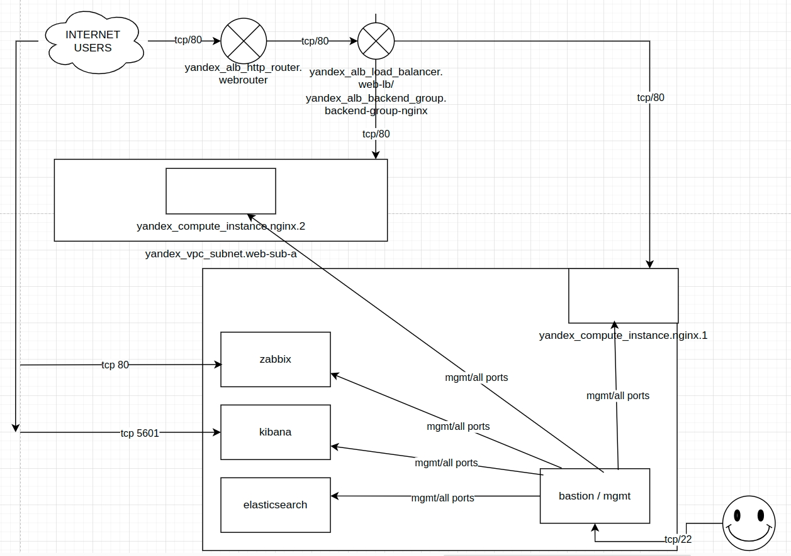
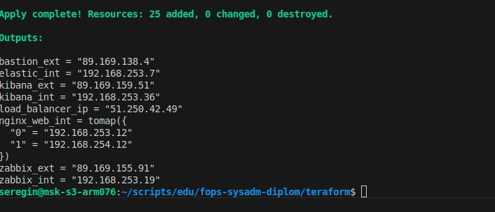

#  Курсовая работа на профессии "DevOps-инженер с нуля"

Содержание
==========
* [Задача](#Задача)
* [Инфраструктура](#Инфраструктура)
    * [Сайт](#Сайт)
    * [Мониторинг](#Мониторинг)
    * [Логи](#Логи)
    * [Сеть](#Сеть)
    * [Резервное копирование](#Резервное-копирование)
    * [Дополнительно](#Дополнительно)
* [Выполнение работы](#Выполнение-работы)
* [Критерии сдачи](#Критерии-сдачи)
* [Как правильно задавать вопросы дипломному руководителю](#Как-правильно-задавать-вопросы-дипломному-руководителю) 

---------
## Задача
Ключевая задача — разработать отказоустойчивую инфраструктуру для сайта, включающую мониторинг, сбор логов и резервное копирование основных данных. Инфраструктура должна размещаться в [Yandex Cloud](https://cloud.yandex.com/).

## Инфраструктура
Для развёртки инфраструктуры используйте Terraform и Ansible. 

Параметры виртуальной машины (ВМ) подбирайте по потребностям сервисов, которые будут на ней работать. 

Ознакомьтесь со всеми пунктами из этой секции, не беритесь сразу выполнять задание, не дочитав до конца. Пункты взаимосвязаны и могут влиять друг на друга.

### Сайт

Создайте две ВМ в разных зонах, установите на них сервер nginx, если его там нет. ОС и содержимое ВМ должно быть идентичным, это будут наши веб-сервера.

Используйте набор статичных файлов для сайта. Можно переиспользовать сайт из домашнего задания.

Создайте [Target Group](https://cloud.yandex.com/docs/application-load-balancer/concepts/target-group), включите в неё две созданных ВМ.

Создайте [Backend Group](https://cloud.yandex.com/docs/application-load-balancer/concepts/backend-group), настройте backends на target group, ранее созданную. Настройте healthcheck на корень (/) и порт 80, протокол HTTP.

Создайте [HTTP router](https://cloud.yandex.com/docs/application-load-balancer/concepts/http-router). Путь укажите — /, backend group — созданную ранее.

Создайте [Application load balancer](https://cloud.yandex.com/en/docs/application-load-balancer/) для распределения трафика на веб-сервера, созданные ранее. Укажите HTTP router, созданный ранее, задайте listener тип auto, порт 80.

Протестируйте сайт
`curl -v <публичный IP балансера>:80` 

### Мониторинг
Создайте ВМ, разверните на ней Zabbix. На каждую ВМ установите Zabbix Agent, настройте агенты на отправление метрик в Zabbix. 

Настройте дешборды с отображением метрик, минимальный набор — по принципу USE (Utilization, Saturation, Errors) для CPU, RAM, диски, сеть, http запросов к веб-серверам. Добавьте необходимые tresholds на соответствующие графики.

### Логи
Cоздайте ВМ, разверните на ней Elasticsearch. Установите filebeat в ВМ к веб-серверам, настройте на отправку access.log, error.log nginx в Elasticsearch.

Создайте ВМ, разверните на ней Kibana, сконфигурируйте соединение с Elasticsearch.

### Сеть
Разверните один VPC. Сервера web, Elasticsearch поместите в приватные подсети. Сервера Zabbix, Kibana, application load balancer определите в публичную подсеть.

Настройте [Security Groups](https://cloud.yandex.com/docs/vpc/concepts/security-groups) соответствующих сервисов на входящий трафик только к нужным портам.

Настройте ВМ с публичным адресом, в которой будет открыт только один порт — ssh. Настройте все security groups на разрешение входящего ssh из этой security group. Эта вм будет реализовывать концепцию bastion host. Потом можно будет подключаться по ssh ко всем хостам через этот хост.

### Резервное копирование
Создайте snapshot дисков всех ВМ. Ограничьте время жизни snaphot в неделю. Сами snaphot настройте на ежедневное копирование.

### Дополнительно
Не входит в минимальные требования. 

1. Для Zabbix можно реализовать разделение компонент - frontend, server, database. Frontend отдельной ВМ поместите в публичную подсеть, назначте публичный IP. Server поместите в приватную подсеть, настройте security group на разрешение трафика между frontend и server. Для Database используйте [Yandex Managed Service for PostgreSQL](https://cloud.yandex.com/en-ru/services/managed-postgresql). Разверните кластер из двух нод с автоматическим failover.
2. Вместо конкретных ВМ, которые входят в target group, можно создать [Instance Group](https://cloud.yandex.com/en/docs/compute/concepts/instance-groups/), для которой настройте следующие правила автоматического горизонтального масштабирования: минимальное количество ВМ на зону — 1, максимальный размер группы — 3.
3. В Elasticsearch добавьте мониторинг логов самого себя, Kibana, Zabbix, через filebeat. Можно использовать logstash тоже.
4. Воспользуйтесь Yandex Certificate Manager, выпустите сертификат для сайта, если есть доменное имя. Перенастройте работу балансера на HTTPS, при этом нацелен он будет на HTTP веб-серверов.

## Выполнение работы
На этом этапе вы непосредственно выполняете работу. При этом вы можете консультироваться с руководителем по поводу вопросов, требующих уточнения.

⚠️ В случае недоступности ресурсов Elastic для скачивания рекомендуется разворачивать сервисы с помощью docker контейнеров, основанных на официальных образах.

**Важно**: Ещё можно задавать вопросы по поводу того, как реализовать ту или иную функциональность. И руководитель определяет, правильно вы её реализовали или нет. Любые вопросы, которые не освещены в этом документе, стоит уточнять у руководителя. Если его требования и указания расходятся с указанными в этом документе, то приоритетны требования и указания руководителя.

## Критерии сдачи
1. Инфраструктура отвечает минимальным требованиям, описанным в [Задаче](#Задача).
2. Предоставлен доступ ко всем ресурсам, у которых предполагается веб-страница (сайт, Kibana, Zabbix).
3. Для ресурсов, к которым предоставить доступ проблематично, предоставлены скриншоты, команды, stdout, stderr, подтверждающие работу ресурса.
4. Работа оформлена в отдельном репозитории в GitHub или в [Google Docs](https://docs.google.com/), разрешён доступ по ссылке. 
5. Код размещён в репозитории в GitHub.
6. Работа оформлена так, чтобы были понятны ваши решения и компромиссы. 
7. Если использованы дополнительные репозитории, доступ к ним открыт. 

## Как правильно задавать вопросы дипломному руководителю
Что поможет решить большинство частых проблем:
1. Попробовать найти ответ сначала самостоятельно в интернете или в материалах курса и только после этого спрашивать у дипломного руководителя. Навык поиска ответов пригодится вам в профессиональной деятельности.
2. Если вопросов больше одного, присылайте их в виде нумерованного списка. Так дипломному руководителю будет проще отвечать на каждый из них.
3. При необходимости прикрепите к вопросу скриншоты и стрелочкой покажите, где не получается. Программу для этого можно скачать [здесь](https://app.prntscr.com/ru/).

Что может стать источником проблем:
1. Вопросы вида «Ничего не работает. Не запускается. Всё сломалось». Дипломный руководитель не сможет ответить на такой вопрос без дополнительных уточнений. Цените своё время и время других.
2. Откладывание выполнения дипломной работы на последний момент.

**Схема сетевой инфраструктуры**

**Листинг файлов**

| имя файла | комментарий |
| ------ | ------ |
| /PROJECTDIR/id_rsa | приватный SSH-ключ (.gitignore) |
| /PROJECTDIR/id_rsa.pub | публичный SSH-ключ (.gitignore) |
| /PROJECTDIR/teraform/bastion.tf | teraform-файл сервера для подключения к инфраструктуре ("Бастион") |
| /PROJECTDIR/teraform/elastic.tf | teraform-файл сервера Elasticsearch |
| /PROJECTDIR/teraform/kibana.tf | teraform-файл сервера Kibana |
| /PROJECTDIR/teraform/nginx.tf | teraform-файл серверов NGINX |
| /PROJECTDIR/teraform/zabbix.tf | teraform-файл сервера Zabbix |
| /PROJECTDIR/teraform/cloud_conf.yaml | файл с метаданными виртуальных машин YandexCloud |
| /PROJECTDIR/teraform/main-datasources.tf | файл с пользовательскими параметрами (админ сервера, метонахождение файлов ключей) |
| /PROJECTDIR/teraform/main-provider.tf | Файл с данными подключения к YadnexCloud (токен вводится вручную при запуске) |
| /PROJECTDIR/teraform/main-resources.tf | Файл с неспецифичными ресурсами ЯО (сети, шлюзы, маршруты, балансировщики, шаблон hosts для ansible) |
| /PROJECTDIR/teraform/main-secgroups.tf | файл с правилами брандмауэра (YandexCloud Security Groups) |
| /PROJECTDIR/ansible/etc/* | конфигурационные файлы Nginx |
| /PROJECTDIR/ansible/elastic.yml | ansible скрипт установки elasticsearch (без настройки) |
| /PROJECTDIR/ansible/kibana.yml | ansible скрипт установки elasticsearch (без настройки) |
| /PROJECTDIR/ansible/kibana.yml | ansible скрипт установки elasticsearch (без настройки) |
| /PROJECTDIR/ansible/zabbix.yml | ansible скрипт установки zabbix (без настройки) |
| /PROJECTDIR/ansible/zabbix.sh | bash скрипт настройки zabbix |
| /PROJECTDIR/ansible/hosts.tpl | шаблон hosts-файла для ansible |
| /PROJECTDIR/ansible/hosts (динамический) | hosts-файл для ansible |

**Технические особенности деплоя**

1. Минимальная конфигурация каждой ВМ (2vcpu, 1ram, 10hdd, непрерываемая, core fraction 5, ubuntu22). 
2. Минимальная конфигурация каждой сети - Nat Gateway, Route Table.
3. После выполнения деплоя teraform по шаблону ansible/hosts.tpl собирается файл hosts для дальнейшего использования teraform
4. После выполнения деплоя ВМ bastion вызывается набор провижнеров: 
5. Первый (file) загружает в /tmp файлы ansible и ssh-ключ для работы с 
6. Второй (file) загружает в /tmp файлы дистрибутивов ELK-стека
7. Третий (remote-exec) устанавливает zabbix-agent на вм. Устанавливает из штатного репозитория, так как у нас неиспользуются специфические настройки zabbix, нет смысла ставить свежие (из репозитория ставится 5 версия).
8. Последний ставит аттрибут 600 на файл ключа (требование SSH) и запускает плейбуки /ansible/*.yml
9. Файлы для деплоя лежат в хранилище дистрибутивов локального компьютера администратора /data/distribs/Linux/elasticsearch/

**Технические особенности деплоя nginx (ansible)**

1. Вебсервер устанавливается из стандартного репозитория;
2. Из директории ansible рекурсивно копируются директории /etc , /var , заменяющие стандартные страницы и файлы конфигураций;
3. Из закаченного ранее набора дистрибутивов ELK-стека загружается filebeat. Автоматизировать проблематично, тк процесс не двигается без установленного заранее kibana. Дальнейшую настройку производим вручную.

**Технические особенности деплоя zabbix (ansible)**

1. Устанавливается из официального репозитория стандартным способом - путем загрузки и установки deb-пакета репозитория;
2. Выполняется стандартный набор действий по устанвовке сервера - https://www.zabbix.com/download?zabbix=7.0&os_distribution=ubuntu&os_version=22.04&components=server_frontend_agent&db=mysql&ws=apache;
3. В конфигурационный файл добавляется строка с паролем СУБД, сервис и веб сервер перезапускаются;
4. Дальнейшую установку и настройки ввиду сложности автоматизации через API производим вручную через вебинтерфейс.

**Технические особенности деплоя ELK-стека**
1. Filebeat установлен на веб-серверах и настроен ansible-плкейбуком;
2. Kibana и Elasticsearch установлены на соответствующих серверах через deb-пакет;
3. Дальнейшую настройку ввиду сложности автоматизации и дальнейшего удобочитания кода проивзодим вручную (скрипты с командамии SED выглядели бы достаточно некрасиво).

**Используемые правила security group**

| имя ресурса | тип IP адреса | Имя Правила  | Правило | Комментарий |
| ------ | ------ | ------ | ------ | ------ | 
| nginx1,2 | внутренний | out_all | tcp/ALL -> 0.0.0.0/0 | стандартное правило для доступа в интернет | 
| nginx1,2 | внутренний | inc_http | 0.0.0.0/0 -> tcp/80 | сервер в локальной сети, поэтому нет смысла фильтровать адреса |
| nginx1,2 | внутренний | inc_zbxagent | 192.168.0.0/16 -> tcp/10050 | |
| nginx1,2 | внутренний | inc_ssh | 192.168.0.0/16 -> tcp/22 | |
| kibana | внешний | out_all | tcp/ALL -> 0.0.0.0/0 | стандартное правило для доступа в интернет | 
| kibana | внешний | inc_kibana | 0.0.0.0/0 -> tcp/5601 | |
| kibana | внешний | inc_ssh | 192.168.0.0/16 -> tcp/22 | |
| kibana | внешний | inc_zbxagent | 192.168.0.0/16 -> tcp/10050 | |
| zabbix | внешний | out_all | tcp/ALL -> 0.0.0.0/0 | стандартное правило для доступа в интернет | 
| zabbix | внешний | inc_ssh | 192.168.0.0/16 -> tcp/22 | |
| zabbix | внешний | inc_http | 0.0.0.0/0 -> tcp/80 | |
| bastion | внешний | out_all | tcp/ALL -> 0.0.0.0/0 | стандартное правило для доступа в интернет | 
| bastion | внешний | inc_ssh_global | 0.0.0.0/0 -> tcp/22 | |
| bastion | внешний | inc_zbxagent | 192.168.0.0/16 -> tcp/10050 | |
| elastic | внутренний | out_all | tcp/ALL -> 0.0.0.0/0 | стандартное правило для доступа в интернет | 
| elastic | внутренний | inc_zbxagent | 192.168.0.0/16 -> tcp/10050 | |
| elastic | внутренний | inc_elk | 192.168.0.0/16 -> tcp/9200 | |
| elastic | внутренний | inc_ssh | 192.168.0.0/16 -> tcp/22 | |

**Результат выполнения teraform+ansible**

Работа балансировщика:

